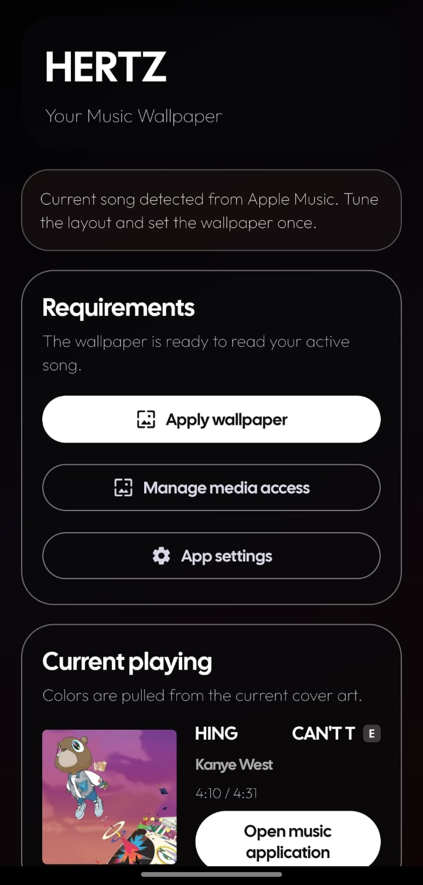
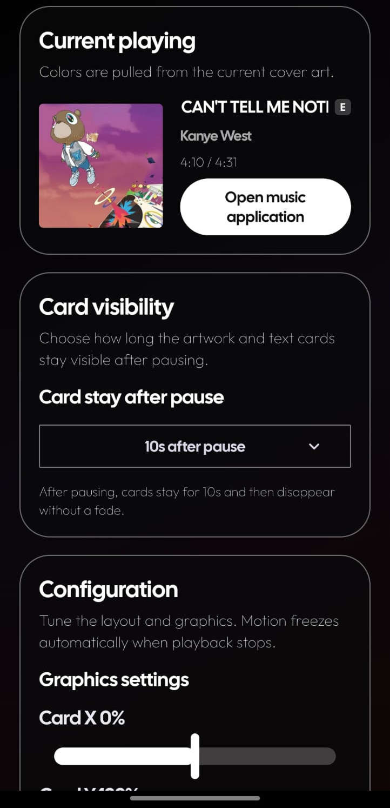
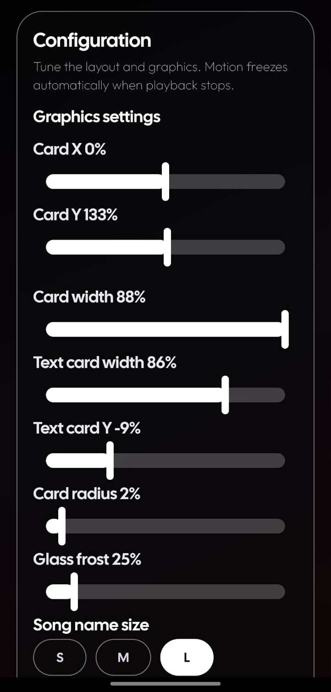
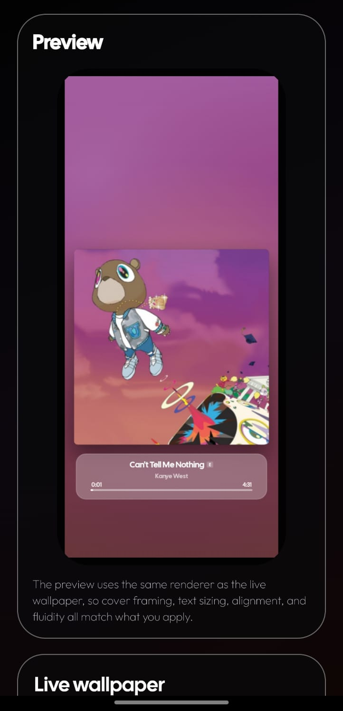
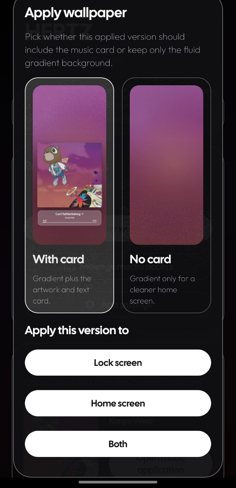
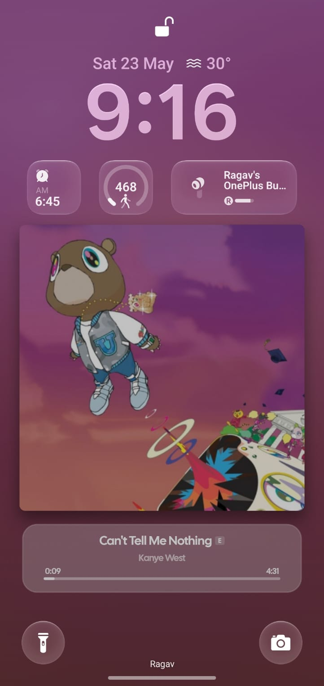
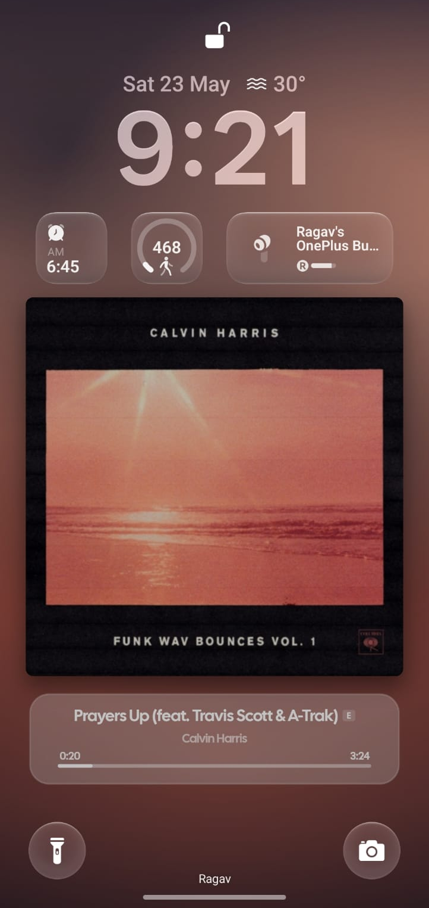
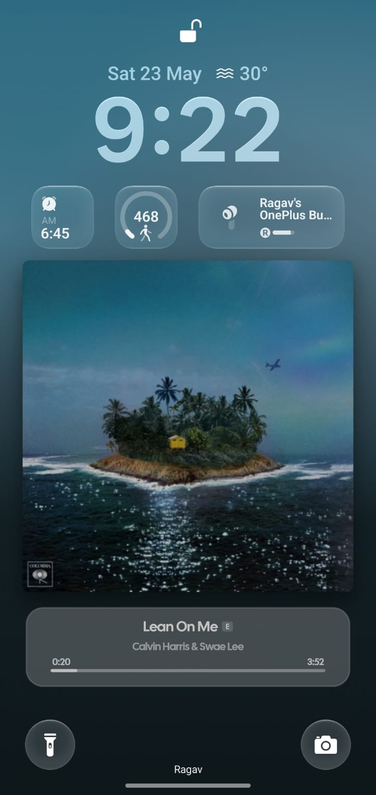
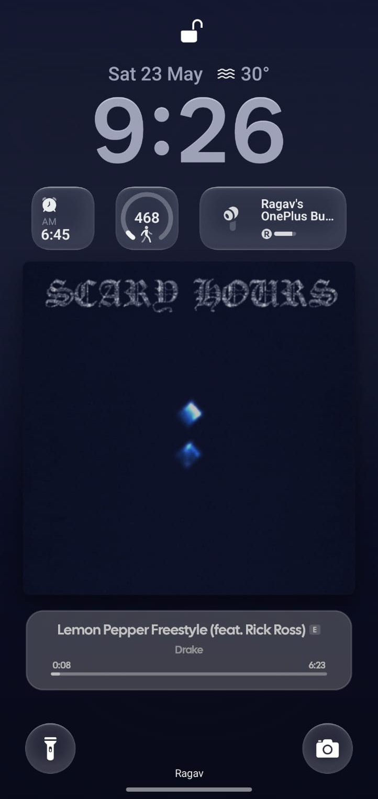

# HERTZ: Music Wallpaper

HERTZ is a music-inspired live wallpaper for Android. It turns the current song artwork into a color-matched gradient wallpaper and can show an optional artwork card plus song details on the lock screen, home screen, or both.

## Highlights

- Live wallpaper background generated from the current song artwork
- Optional lock-screen style artwork card with title, artist, explicit badge, and timeline
- Separate apply flow for `With card` and `No card` modes
- Card visibility timeout after pause: immediately, 5s, 10s, 20s, 30s, 1m, 5m, or 10m
- Adjustable artwork card size, text card width, card radius, frost, blur, text sizing, alignment, and placement
- Gradient color picker with presets and draggable artwork sample points
- Smooth in-app marquee for long song titles and artist names
- Lock-screen song and artist text respect the selected alignment and crop inside the card when too long
- Local artwork cache for faster repeated songs
- Battery protection that hides music cards at 20% battery or below

## Screenshots

Release screenshots are stored in `screenshots/` so the README previews the app and wallpaper directly on GitHub.

Swipe sideways to see the full gallery.

| Setup | Card visibility | Configuration | Preview | Apply wallpaper | Pink lock screen | Warm lock screen | Blue lock screen | Dark lock screen |
| --- | --- | --- | --- | --- | --- | --- | --- | --- |
|  |  |  |  |  |  |  |  |  |

## Download APK

[Download the latest release APK](https://github.com/ragav-byte/HERTZ-Music-Wallpaper/raw/main/downloads/HERTZ-Music-Wallpaper-v1.0-release.apk)

This signed release APK is included for testing before the broader app-store release.

## How HERTZ Gets Music Data

HERTZ uses Android media APIs instead of repeatedly scanning the phone.

Primary data source:

- `MediaSessionManager`
- `MediaController`
- `MediaController.Callback`
- `onMetadataChanged()`
- `onPlaybackStateChanged()`

The app reads the active media session published by the music player. From that session it uses:

- song title
- artist
- album
- playback state
- current playback position
- playback speed
- duration
- artwork URI or artwork bitmap

Notification access is used mainly to discover active media sessions and as a fallback for simple text metadata. The app does not constantly scrape notifications for heavy artwork work.

If a music player publishes a remote artwork URI, HERTZ may download that artwork directly to render the wallpaper. This happens locally on the device for artwork display and caching only; HERTZ does not upload your music data or artwork to a server.

Browser and video-player sessions such as Chrome, Brave, and YouTube are filtered out so normal web/video playback does not take over the wallpaper experience.

## Expected Loading Times

HERTZ is optimized for cache-first updates, especially when the phone wakes from the lock screen.

- Repeated song already in memory cache: about `0.1s-0.4s`
- Repeated song loaded from local disk cache: about `0.4s-1.2s`
- New song when Android exposes artwork quickly: usually within about `1.5s`
- New song with remote artwork or slower metadata publishing: commonly `1s-3s`
- Worst case when the music app delays artwork metadata: can still take up to about `5s`

Song title, artist, timeline, and playback state are applied before slower artwork loading finishes, so the wallpaper can feel responsive even while high-quality artwork is still being prepared.

## Gradient Color Picking

HERTZ samples the current cover art to build the wallpaper background.

- The default `Spatial` preset samples top-left, center, and bottom-right regions of the artwork.
- Other presets include left-to-right, top-to-bottom, diagonal reverse, and centered glow.
- `Custom` mode lets you drag three numbered anchor dots directly on the cover art preview.
- The selected point colors are previewed in the app before applying the wallpaper.
- Gradient brightness adjusts color richness/saturation instead of simply brightening the screen.
- Near-black anchor picks render as neutral dark greys instead of introducing fake blue/purple tint.

Palette extraction runs only when artwork or gradient settings change, using a downscaled image so the wallpaper stays lightweight.

## Why It Should Not Hurt Battery Or Heat The Phone

The wallpaper is designed to be event-driven and lightweight.

- It updates when Android reports a media metadata or playback state change.
- It avoids continuous heavy polling.
- Artwork decoding and cache work happen off the main thread.
- Artwork is resized before processing so full-size album art is not repeatedly processed.
- Blur/background work is generated per artwork change and reused.
- Motion freezes when playback is paused or the wallpaper is not active.
- Cards are disabled automatically at 20% battery or below.
- Timeline progress is calculated locally from Android playback state instead of forcing constant metadata reads.

This keeps the wallpaper closer to a lightweight renderer than a constantly running app screen.

## Artwork Cache

HERTZ keeps a small local artwork cache so repeated songs can load faster.

- Recent artwork is cached in memory for quick reuse.
- Resized artwork is cached on disk for future sessions.
- Cached items that are not used for 24 hours are deleted automatically.
- The cache is local-only and used only for artwork speed.
- Cache limits are kept bounded so the app does not grow endlessly.

First-time artwork may still take a moment because Android or the music app has to publish the image through the media session. Repeated songs should feel faster because HERTZ can reuse cached artwork and remembered track duration.

## Privacy

HERTZ does not collect, upload, sell, or sync sensitive personal data.

The app works locally on your device and only uses:

- notification/media access to read active media metadata from the current player
- wallpaper access to render the live wallpaper
- local cache storage for resized artwork and palette data

No account login, remote analytics, or cloud sync is required for the core wallpaper experience.

## Install The APK

1. Copy the generated APK file to your mobile.
2. Install it using APKMirror Installer.
3. Open HERTZ.
4. Enable media access when Android asks for it.
5. Tap `Apply wallpaper`.
6. Pick `With card` or `No card`.
7. Apply it to the lock screen, home screen, or both.

Release APK path after building:

`downloads/HERTZ-Music-Wallpaper-v1.0-release.apk`

## Notice

- HERTZ is newly developed and still being tested.
- Brand-new songs are commonly visible within about 1.5 seconds when Android and the music app publish metadata quickly.
- Some songs can still take up to about 5 seconds before artwork appears if the music app delays artwork metadata.
- Repeated songs should usually load faster because of the local cache.
- Music cards do not show at 20% battery or below to protect battery life and reduce heat.
- Some Android phones handle live wallpapers differently, so lock-screen-only and home-screen behavior may vary by device.
- HERTZ will be released to the app store after more testing.
